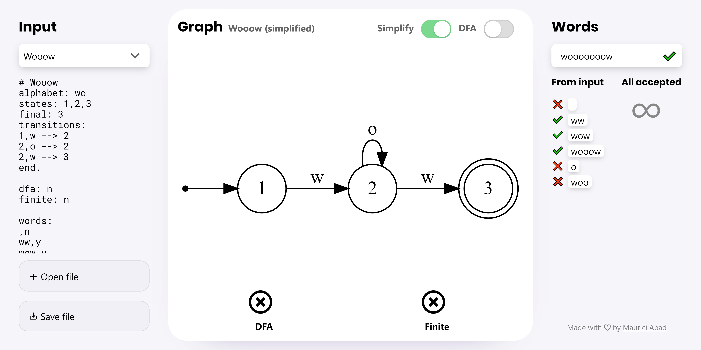

# State Machine | ALE 2 Fall 2019 | Maurici Abad

State machine web app by [Maurici Abad Gutierrez](https://mauriciabad.com)

> Use it here: https://ale2.netlify.com/

Main features:

- Open and save files.
- Visualize any DFA, NDA or PDA.
- Evaluate if an arbitrary string is accepted strings.
- Convert a NDA to DFA.
- Evaluate if DFA or NDA is finite.
- List all accepted strings exept is they are inifnite.
- Accept wrong inputs and fix them.
- Simplify DFA and NDA to a version with less nodes and ε.
- Real time processing and really high performance.
- Intuitive, clean and fast UI.



## Assignment 1: parse + dfa

### Parsing

For parsing I created the `RawGraph` class, that is a regular JavaScript object with all the information from the input structured.

The class has a constructor that accepts a string.

It parses the information using regex and I made them really carfeully, so that they accept a very wide variety of errors. When input is unpredictable a nice message is displayed.

#### Accepted input errors

- It **never crashes** when something is missing or wrong.
- Can skip almost any separation character, specially whitespaces spaces and commas.
- The fields `states`, `aphabet` and `stack` are rebundant information, so they are extracted from other places. For example:
  - If you use a state in `transitions` that's not in `states`, it is added.
  - If you have a state in `states` but it not used enywhere else, it doesn't get removed.
  - Both examples work for state names, transition letters and stack letters.
- Statements can be in any order.
- In boolean fiends if it's not: 'y', 'ye', 'yes', 'true', 'tru', 'tr', 't', '1', 'ok' or 'si': it's treated as false.
- Also parses comments.
- In regex, unclosed parenthesis are closes at the end.
- In regex, missing commas are added.
- In regex, consecutive and trailing commas are removed.
- In regex, `.` and `|` operators accept any number of arguments, like: `|(a,b,c,d,e,...)`.

All this transitions would be accepted:

```
transitions :
  1 ,  a  2 
1, --> 2 
1, ->  2
1 2 3, a -> 1 2 3
1,a [,] ----> 2
1,a [] > 2
1,a [x] - 2
1,_[xy 2
1,[xy2

end.
```

This are the used regex:

```js
const regxParser = {
  comments: /^ *# *(.*) *$/gm,
  regex: /(regex|re|regexr|regular expression)s? *: *(.*)/i,
  alphabet: /alphabets? *: *(\w*)/i,
  stack: /stacks? *: *(\w*)/i,
  states: /states? *: *((.*)*)/i,
  final: /final *: *((.*)*)/i,
  transitions: /transitions? *: *([^]+?) *end\.?/i,
  transition: /^ *([^\n,\->[\]]+) *,? *(\w?) *(\[ *(\w?) *,? *(\w?) *\]?)? *-*>? *([^\n,\->[\]]*)?/gm,
  dfa: /dfa *: *(\w*)/i,
  finite: /finite *: *(\w*)/i,
  words: /words? *: *([^]+?) *end\.?/i,
  word: /^ *(\w*)[^\w\n]+(\w+)/gm,
};
```

### Evaluate if graph is DFA

#### Optimitations

1. My implementation stops whenever the condition can't be satisfied anymore, it doesn't have to keep going until the end.
1. This  value is only evaluated the first time you get the value.
1. Use efficent data structures. In this case a Set.

This is the code:

```js
get isDfa() {
  if (this._isDfa !== undefined) return this._isDfa;
  this._isDfa = this.evalIsDfa();
  return this._isDfa;
}

evalIsDfa() {
  for (const node of this.nodes.values()) {
    const foundLetters = new Set();

    for (const adjacentcy of node.adjacencies) {
      if (foundLetters.has(adjacentcy.label)) return false;
      foundLetters.add(adjacentcy.label);
    }

    if (foundLetters.size !== this.alphabet.size) return false;
  }

  return true;
}
```

### Graph display

I used [Viz.js](http://viz-js.com/), it's a version of [Graph Viz](http://www.graphviz.org/) compiled to Web assembly. It generates an svg for any graph.

Because generating the svg can take a relatively long time, I do it asyncronously with a web worker and display a loading spinner while it's processing.

If you input a graph with a lot of edges, it runs out of memmory. When that happens, you see the error message, but you can still use all the other functionalities, just without the visualization.

Also, as an optimization. The svg is only computed once and stored in memory, so if you switch the `simplified` toggle on and off really quick, the app is responsive.

#### Errors

- Invalid Input
- Invalid Regex: Missing operator
- Invalid Regex: Parenthesis are wrong
- Invalid Regex: Missing operands
- Invalid Regex: Missing operator
- Graph too big, skiping drawing (Other funtionalities still usable)
- Empty (Other funtionalities still usable)

## Assignment 2: accept string


## Assignment 3: regular expression

### Parsing

- Add `regex: <your regex>` line in the input to use it.
  - Also accepted: `regex`, `re`, `regexr`, `regular expression` and respective plurals.
- When `regex:` is present the following fields are ignored:
`alphabet`, `stack`, `states`, `final` and `transitions`.
- When a regex graph is generated, the node names are hidden. (Exept the `Sink` node)

## Assignment 4: finite


## Assignment 5: ndfa


## Assignment 6: pda


## Software design


## Design Documentation


## UI

- explain graphs and svg are saved
- Input is saved between sessions
- Input changes are displayed immediately
- explain graph title and download

## Testing


## Other contributions


### Simplify


### Webpack


